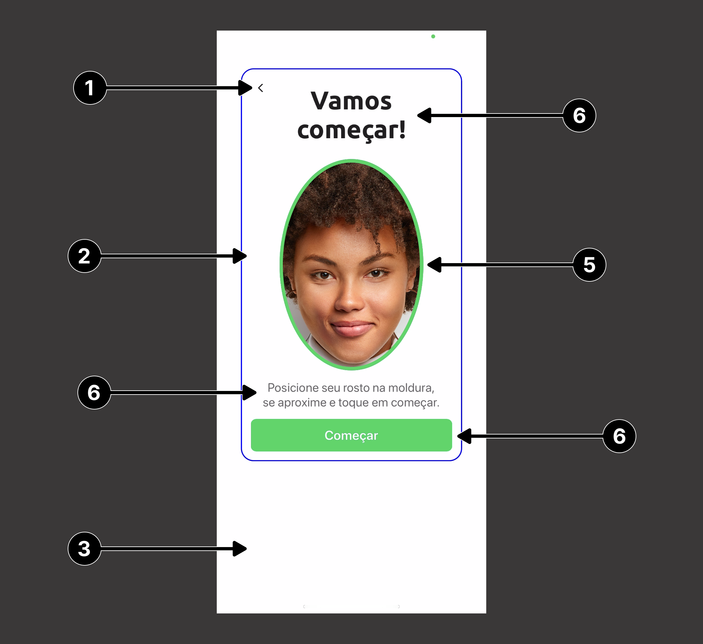
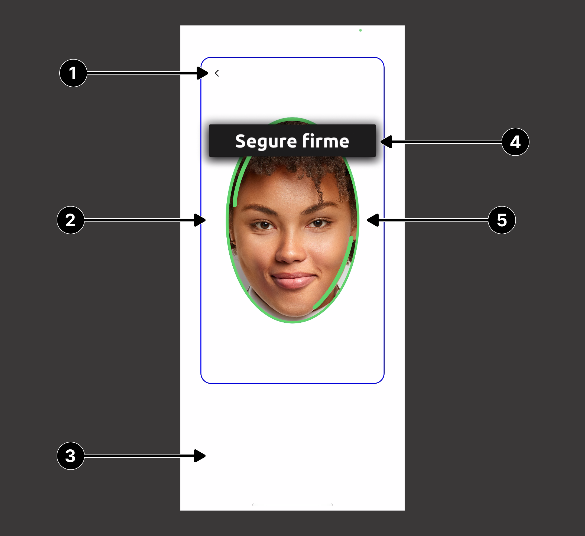
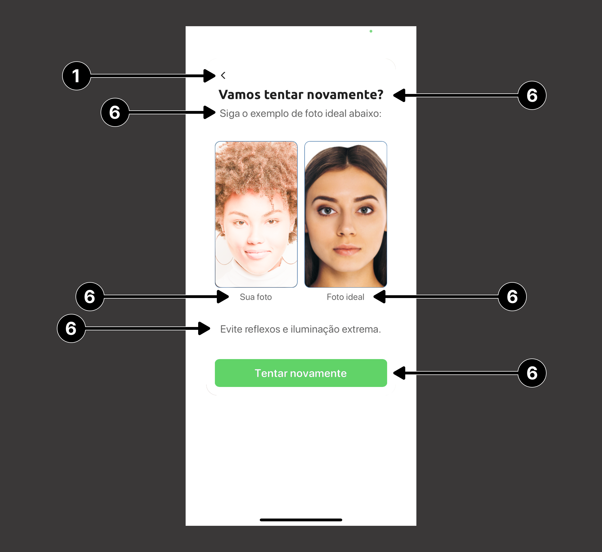
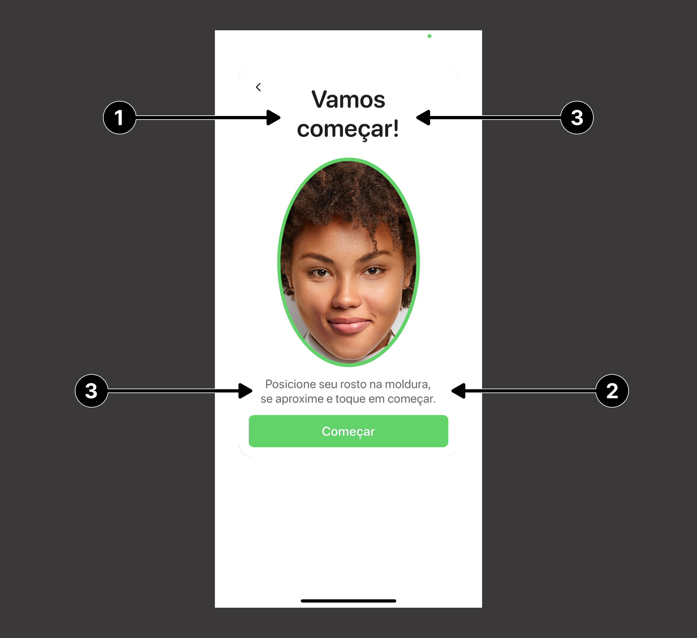
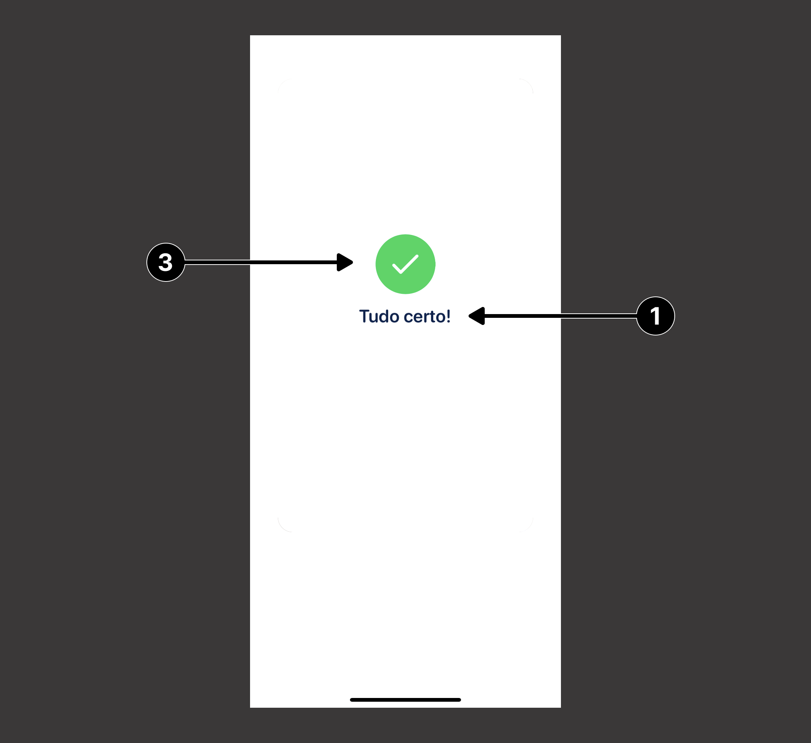
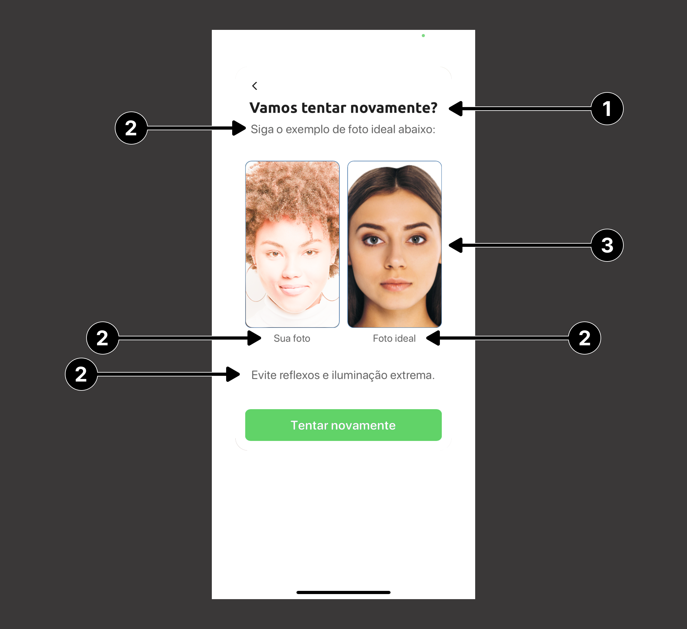
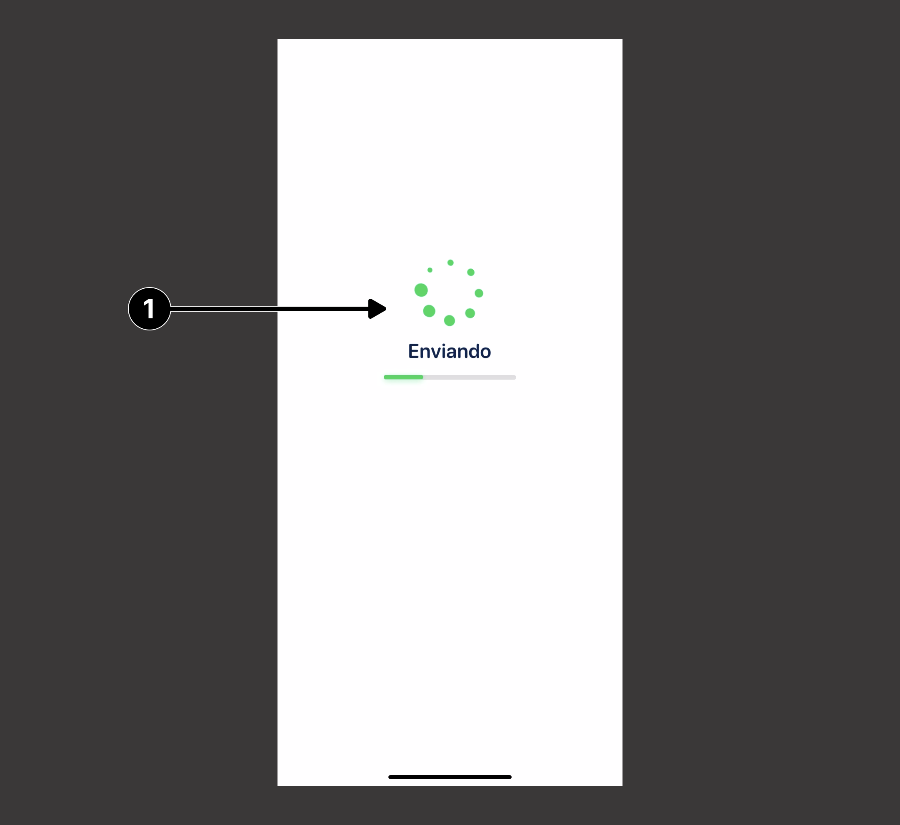
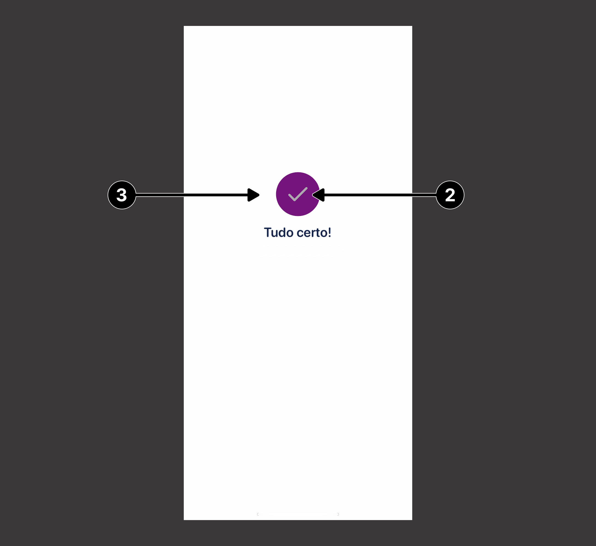

# Guia de Customização: Liveness3DTheme 

A customização do fluxo de prova de vida, dar-se por meio da utilização da `Liveness3DTheme`. Essa classe na sua construção recebe o template padrão, podendo ser DarkTheme ou LightTheme. Os temas são atribuídos aos argumentos `defaultTheme` e `lowLightTheme` do ``Liveness3DUser``.<br>

```swift
var defaultTheme = Liveness3DTheme(.dark)
defaultTheme.cancelButtonCustomizationLocation = .left

var lowLightTheme = Liveness3DTheme(.light)
lowLightTheme.cancelButtonCustomizationLocation = .left

let liveness3DUser = Liveness3DUser(
    appKey: appKey,
    environment: .HML,
    defaultTheme: defaultTheme,
    lowLightTheme: lowLightTheme
)
```
> **Considerações**: <br/>
> 1. Ambos os temas serão aplicados de acordo com o funcionamento interno do SDK, onde o tema padrão (_defaultTheme_) será utilizado até que haja a necessidade de utilizar o tema para pouco luminosidade (_lowLightTheme_).
> 2. Todos as propriedades do `Liveness3DTheme` possuem um valor _default_, dessa forma, não é necessário especificar todas as propriedades para exibir a customização.

<br/>

Abaixo, estão mapeadas as propriedades para customização do `Liveness3DTheme`.

## Elementos comuns

### 1. Botão de cancelar
| **Atributo**                         | **Tipo**             | **Descrição**                                    |
| :----------------------------------- | :------------------- | :----------------------------------------------- |
| cancelButtonCustomizationCustomImage | UIImage              | Cancela a operação e retorna para view anterior. |
| cancelButtonCustomizationLocation    | CancelButtonLocation | Enum que determina a posição do botão. Esquerda, direita ou desabilitado. |

```swift
public enum CancelButtonLocation: Int {
    case topLeft = 0
    case topRight = 1
    case disabled = 2
}
```

### 2. Frame
| **Atributo**                      | **Tipo**          | **Descrição**                                             |
| :-------------------------------- | :---------------- | :-------------------------------------------------------- |
| frameCustomizationBorderWidth     | Int32             | Modifica a largura da borda do frame.                     |
| frameCustomizationBorderColor     | UIColor           | Modifica a cor da borda do frame.                         |
| frameCustomizationBackgroundColor | UIColor           | Modifica a cor de fundo do frame.                         |
| frameCustomizationCornerRadius    | Int32             | Modifica o tamanho do arredondamento das bordas do frame. |
| frameCustomizationShadow          | Liveness3DShadow? | Adiciona uma sombra ao frame.                             |

```swift
public struct Liveness3DShadow {
    let color: UIColor
    let opacity: Float
    let radius: Float
    let offset: CGSize
    let insets: UIEdgeInsets
}
```

### 3. Overlay
| **Atributo**                          | **Tipo** | **Descrição**                                                        |
| :------------------------------------ | :------- | :------------------------------------------------------------------- |
| overlayCustomizationBackgroundColor   | UIColor  | Modifica a cor de fundo da camada de overlay.                        |
| overlayCustomizationBrandingImage     | UIImage? | Adiciona uma imagem na camada de overlay.                            |
| overlayCustomizationShowBrandingImage | Bool     | Propriedade booleana que ativa a visualização da imagem customizada. |

### 4. Feedback Bar
| **Atributo**                         | **Tipo**          | **Descrição**                                             |
| :----------------------------------- | :---------------- | :-------------------------------------------------------- |
| feedbackCustomizationCornerRadius    | Int32             | Modifica o tamanho do arredondamento das bordas da barra. |
| feedbackCustomizationBackgroundColor | UIColor           | Modifica a cor de fundo da barra.                         |
| feedbackCustomizationTextColor       | UIColor           | Modifica a cor do texto do feedback.                      |
| feedbackCustomizationTextFont        | UIFont?           | Adiciona uma fonte customizada para o texto do feedback.  |
| feedbackCustomizationShadow          | Liveness3DShadow? | Adiciona uma sombra ao componente.                        |

### 5. Oval
| **Atributo**                          | **Tipo** | **Descrição**                                                   |
| :------------------------------------ | :------- | :-------------------------------------------------------------- |
| ovalCustomizationStrokeColor          | UIColor  | Modifica a cor da borda da camada oval.                         |
| ovalCustomizationStrokeWidth          | Int32    | Modifica a largura da borda da camada oval.                     |
| ovalCustomizationProgressColor1       | UIColor  | Modifica a cor da borda de progresso da camada oval.            |
| ovalCustomizationProgressColor2       | UIColor  | Modifica a cor da borda de progresso da camada oval.            |
| ovalCustomizationProgressStrokeWidth  | Int32    | Modifica a largura da borda do progresso da camada oval.        |
| ovalCustomizationProgressRadialOffset | Int32    | Modifica o distânciamento da borda de progresso da camada oval. |

### 6. Guidance
| **Atributo**                                        | **Tipo** | **Descrição**                                                     |
| :-------------------------------------------------- | :------- | :---------------------------------------------------------------- |
| guidanceCustomizationHeaderFont                     | UIFont?  | Adiciona uma fonte customizada para o header das telas de Ready e Retry. Esse valor será sobrescrito pelos valores de `readyScreenCustomizationHeaderFont` ou `retryScreenCustomizationHeaderFont`. |
| guidanceCustomizationSubtextFont                    | UIFont?  | Adiciona uma fonte customizada para o subtext das telas de Ready e Retry. Esse valor será sobrescrito pelos valores de `readyScreenCustomizationSubtextFont` ou `retryScreenCustomizationSubtextFont`. |
| guidanceCustomizationButtonBackgroundNormalColor    | UIColor  | Modifica a cor de fundo do botão na sua condição padrão.          |
| guidanceCustomizationButtonBackgroundHighlightColor | UIColor  | Modifica a cor de fundo do botão na sua condição de destaque.     |
| guidanceCustomizationButtonBackgroundDisabledColor  | UIColor  | Modifica a cor de fundo do botão na sua condição de desabilitado. |
| guidanceCustomizationButtonTextNormalColor          | UIColor  | Modifica a cor do texto do botão na sua condição padrão.          |
| guidanceCustomizationButtonTextHighlightColor       | UIColor  | Modifica a cor do texto do botão na sua condição de destaque.     |
| guidanceCustomizationButtonTextDisabledColor        | UIColor  | Modifica a cor do texto do botão na sua condição de desabilitado. |
| guidanceCustomizationButtonFont                     | UIFont?  | Adiciona uma fonte customizada para o texto do botão.             |
| guidanceCustomizationButtonBorderColor              | UIColor  | Modifica a cor da borda do botão.                                 |
| guidanceCustomizationButtonBorderWidth              | Int32    | Modifica a espessura da borda do botão.                           |
| guidanceCustomizationButtonCornerRadius             | Int32    | Modifica o arredondamento das bordas do botão.                    |

<br/>
<div>
    
    
    
</div>

---

## Tela de pronto para começar

### 1. Header
| **Atributo**                            | **Tipo** | **Descrição**                                 |
| :-------------------------------------- | :------- | :-------------------------------------------- |
| readyScreenCustomizationHeaderFont      | UIFont?  | Adiciona uma fonte customizada para o header. |
| readyScreenCustomizationHeaderTextColor | UIColor  | Modifica a cor da fonte do texto.             |

### 2. Subtext
| **Atributo**                             | **Tipo** | **Descrição**                                  |
| :--------------------------------------- | :------- | :--------------------------------------------- |
| readyScreenCustomizationSubtextFont      | UIFont?  | Adiciona uma fonte customizada para o subtext. |
| readyScreenCustomizationSubtextTextColor | UIColor  | Modifica a cor da fonte do texto.              |

### 3. Textos

| **Atributo**                                       | **Tipo** | **Descrição**                                    |
| :------------------------------------------------- | :------- | :----------------------------------------------- |
| readyScreenCustomizationTextBackgroundColor        | UIColor? | Modifica a cor de fundo.                         |
| readyScreenCustomizationTextBackgroundCornerRadius | Int32    | Modifica o tamanho do arredondamento das bordas. |

> **_Observação:_**
> As propriedades do **item 3** somente serão aplicadas em telas pequenas. 

<br/>


---

## Tela de resultado

### 1. Textos
| **Atributo**                         | **Tipo** | **Descrição**                                              |
| :----------------------------------- | :------- | :--------------------------------------------------------- |
| resultScreenCustomizationMessageFont | UIFont?  | Adiciona uma fonte customizada para a mensagem de sucesso. |
| resultScreenCustomizationTextColor   | UIColor  | Modifica a cor de fundo quando estiver em primeiro plano.  |

### 2. Barra de carregamento
| **Atributo**                                      | **Tipo** | **Descrição**                                                        |
| :------------------------------------------------ | :------- | :------------------------------------------------------------------- |
| resultScreenCustomizationShowUploadProgressBar    | Bool     | Propriedade booleana que ativa a visualização da barra de progresso. |
| resultScreenCustomizationUploadProgressFillColor  | UIColor  | Modifica a cor do preenchimento da barra de progresso.               |
| resultScreenCustomizationUploadProgressTrackColor | UIColor  | Modifica a cor da barra de progresso.                                |

### 3. Animação
| **Atributo**                                    | **Tipo**             | **Descrição**                                  |
| :---------------------------------------------- | :------------------- | :--------------------------------------------- |
| resultScreenCustomizationAnimationRelativeScale | Float                | Determina o escalonamento da animação e da barra de carregamento. O valor mínimo e máximo para essa propriedade são **0.5** e **1.5** respectivamente, ultrapassados esses limites durante a atribuição, o valor será ajustado para o limite mais próximo (_0.5_ ou _1.5_). |
| resultScreenCustomizationAnimationStyle         | ResultAnimationStyle | Determina o tipo de animação será utilizada juntamente com sua customização. |

```swift
public enum ResultAnimationStyle {
    case blob(appearance: BlobAnimationAppearance)
    case spinner(appearance: SpinnerAnimationAppearance)
    case image(appearance: ImageAnimationAppearance)
    case custom(delegate: CustomResultAnimationDelegate)
}
```

<br/>
<div>
    
    
</div>

---

## Tela de retentativa

### 1. Header
| **Atributo**                            | **Tipo** | **Descrição**                                             |
| :-------------------------------------- | :------- | :-------------------------------------------------------- |
| retryScreenCustomizationHeaderFont      | UIFont?  | Adiciona uma fonte customizada para a mensagem do header. |
| retryScreenCustomizationHeaderTextColor | UIColor  | Modifica a cor da fonte do header.                        |

### 2. Customização do Subtext
| **Atributo**                             | **Tipo** | **Descrição**                                              |
| :--------------------------------------- | :------- | :--------------------------------------------------------- |
| retryScreenCustomizationSubtextFont      | UIFont?  | Adiciona uma fonte customizada para a mensagem do subtext. |
| retryScreenCustomizationSubtextTextColor | UIColor  | Modifica a cor da fonte do subtext.                        |

### 3. Imagem
| **Atributo**                              | **Tipo** | **Descrição**                                                    |
| :---------------------------------------- | :------- | :--------------------------------------------------------------- |
| retryScreenCustomizationImageBorderColor  | UIColor  | Modifica a cor da borda do preview da imagem de retentativa.     |
| retryScreenCustomizationImageBorderWidth  | Int32    | Modifica a largura da borda do preview da imagem de retentativa. |
| retryScreenCustomizationImageCornerRadius | Int32    | Modifica o tamanho do arredondamento das bordas.                 |

<br/>


-----

## Animação

A animação da tela de resultado pode assumir três valores: `blob(appearance:)`, `image(appearance:)`, `spinner(appearance:)` ou `custom(delegate:)`, esses valores são atribuídos a propriedade `resultScreenCustomizationAnimationStyle` do `Liveness3DTheme`. Caso nenhum valor seja atribuído a essa propriedade o valor *spinner* será aplicado por padrão.

```swift
var theme = Liveness3DTheme(.light)

theme.resultScreenCustomizationAnimationStyle = .blob(appearance: customAppearance)
theme.resultScreenCustomizationAnimationStyle = .image(appearance: customAppearance)
theme.resultScreenCustomizationAnimationStyle = .spinner(appearance: customAppearance)
theme.resultScreenCustomizationAnimationStyle = .custom(delegate: animationDelegate)
```

<br>

### **Blob Animation**

<br>

| **Descrição**            | **Animação** | **Customização** |
| :----------------------- | :----------- | :--------------- |
| Exemplo da <br> Animação |  | A customização da animação de Blob é feita através do<br>objeto do tipo `BlobAnimationAppearance`. |

<br>

### `BlobAnimationAppearance`
| **Indice** | **Propriedade**            | **Tipo** | **Descrição**                                                                   |
| :--------- | :------------------------- | :------- | :------------------------------------------------------------------------------ |
| (**1**)    | `blobColor`                | UIColor  | Altera a cor do *blob*.                                                         |
| (**2**)    | `checkmarkForegroundColor` | UIColor  | Altera a cor do *checkmark* ao final<br>da animação de carregamento.            |
| (**3**)    | `checkmarkBackgroundColor` | UIColor  | Altera a cor do circulo do *checkmark*<br>ao final da animação de carregamento. |

<br>

### Código de customização

```swift
let customAppearance = BlobAnimationAppearance(
    blobColor: .blue,
    checkmarkForegroundColor: .systemPink,
    checkmarkBackgroundColor: .yellow
)
theme.resultScreenCustomizationAnimationStyle = .blob(appearance: customAppearance)
```
<br>

### Resultado

<div>
    
    
</div>

---
<br/>

### **Spinner Animation**
<br>

| **Descrição**            | **Animação**                                                         | **Customização**                                                                                         |
| :----------------------- | :------------------------------------------------------------------- | :------------------------------------------------------------------------------------------------------- |
| Exemplo da <br> Animação |  | A customização da animação de Spinner é feita através do<br>objeto do tipo `SpinnerAnimationAppearance`. |

### `SpinnerAnimationAppearance`
| **Indice** | **Propriedade**            | **Tipo** | **Descrição**                                                                   |
| :--------- | :------------------------- | :------- | :------------------------------------------------------------------------------ |
| (**1**)    | `spinnerColor`             | UIColor  | Altera a cor do *spinner*                                                       |
| (**2**)    | `checkmarkForegroundColor` | UIColor  | Altera a cor do *checkmark* ao final<br>da animação de carregamento.            |
| (**3**)    | `checkmarkBackgroundColor` | UIColor  | Altera a cor do circulo do *checkmark*<br>ao final da animação de carregamento. |

<br>

### Código de customização

```swift
let customAppearance = SpinnerAnimationAppearance(
    spinnerColor: .red,
    checkmarkForegroundColor: .yellow,
    checkmarkBackgroundColor: .blue
)
theme.resultScreenCustomizationAnimationStyle = .spinner(appearance: customAppearance)
```
<br>

### Resultado

<div>
    
    
</div>

---
<br>

### **Image Animation**
<br>

| **Descrição**            | **Animação**                                                         | **Customização**                                                                                     |
| :----------------------- | :------------------------------------------------------------------- | :--------------------------------------------------------------------------------------------------- |
| Exemplo da <br> Animação |  | A customização da animação de Image é feita através do<br>objeto do tipo `ImageAnimationAppearance`. |

### `ImageAnimationAppearance`
| **Indice** | **Propriedade**            | **Tipo** | **Descrição**                                                                        |
| :--------- | :------------------------- | :------- | :----------------------------------------------------------------------------------- |
| (**1**)    | `image`                    | UIImage? | Fornece a imagem que será utilizada como indicador de loading.                       |
| (**1**)    | `rotationInterval`         | Int32    | Determina a duração de uma rotação completa da imagem de loading (em milissegundos). |
| (**2**)    | `checkmarkForegroundColor` | UIColor  | Altera a cor do *checkmark* ao final<br>da animação de carregamento.                 |
| (**3**)    | `checkmarkBackgroundColor` | UIColor  | Altera a cor do circulo do *checkmark*<br>ao final da animação de carregamento.      |

<br>

### Código de customização

```swift
let customAppearance = ImageAnimationAppearance(
    image: UIImage(named: "LoadingImage"),
    rotationInterval: 1500,
    checkmarkForegroundColor: .lightGray,
    checkmarkBackgroundColor: .purple
)
theme.resultScreenCustomizationAnimationStyle = .image(appearance: customAppearance)
```
<br>

### Resultado

<div>
    
    
</div>

---
<br>

### **Custom Animation**
<br>

| **Descrição**            | **Animação**                                                     | **Customização**                                                                                                                            |
| :----------------------- | :--------------------------------------------------------------- | :------------------------------------------------------------------------------------------------------------------------------------------ |
| Exemplo da <br> Animação |  | A animação personalizada é feita através de um<br>objeto que deve estar em conformidade com o<br>protocolo `CustomResultAnimationDelegate`. |

### `CustomResultAnimationDelegate`
| **Indice** | **Método**                      | **Tipo de retorno** | **Descrição**             |
| :--------- | :------------------------------ | :------------------ | :------------------------ |
| (**1**)    | `createActivityIndicatorView()` | UIView?             | Altera a cor do *spinner* |
| (**2**)    | `createSuccessAnimationView()`  | UIView?             | Altera a cor do *checkmark* ao final<br>da animação de carregamento. |

<br>

### Código de customização

```swift
class CustomResultAnimation: CustomResultAnimationDelegate {
    func createActivityIndicatorView() -> UIView? {
        let activityIndicator = UIView()
        activityIndicator.backgroundColor = .red
        return activityIndicator
    }
    
    func createSuccessAnimationView() -> UIView? {
        let successAnimation = UIView()
        successAnimation.backgroundColor = .blue
        return successAnimation
    }
}
```

```swift
theme.resultScreenCustomizationAnimationStyle = .custom(delegate: CustomResultAnimation())
```
<br>

### Resultado

<div>
    
    
</div>
