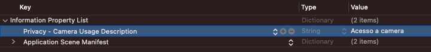

#  Liveness3D para iOS

Neste repositório você vai encontrar as documentações para **iOS** sobre o **Liveness 3D**.

##  Instalação

O SDK está disponível via [CocoaPods](https://cocoapods.org/about) *(Forma recomendada)* ou via instalação manual.

###  CocoaPods
1. Caso não possua um arquivo `Podfile` no seu projeto, basta executar o comando abaixo na raiz do projeot que um novo arquivo desse será criado.
```rb
pod init
```

2. No início do `Podfile`, inclua a linha:

```rb
source 'https://github.com/oititec/ios-artifactory.git'
```

2. Após isso, adicione a dependência:

```rb
pod 'OILiveness3D', '~> x.y.z'
```

4. Execute o comando de instalação dos *pods*:
```rb
pod install
```

5. Abra o arquivo `.xcworkspace` do seu projeto.

###  Instalação manual

Os XCFramwworks para instalação manual estão disponíveis na pasta [Frameworks](/Frameworks).

##  Integração

###  Permissões de acesso

No `Info.plist` do projeto, adicione a descrição de uso de câmera (`Privacy - Camera Usage Description`).



###  Descrição, implementação e customização

As instruções de uso, integração, implementação e customização do **Liveness 3D** podem ser acessadas nos links abaixo: 

  - [Descrição e Resultados](Documentation/About/Description.md);
  - [Guia de Implementação](Documentation/About/Usage.md);
  - [Guia de Customização: Views](Documentation/Customization/CustomViews.md);
  - [Guia de Customização: Liveness3DTheme](Documentation/Customization/Liveness3DTheme.md).
  - [Guia de Customização: Textos](Documentation/Customization/CustomTexts.md).

##  Guia de migração

### Changelog
- Alterações a partir versão 1.0.0 podem ser encontradas [neste link](Documentation/MigrationGuide/Changelog/1.0.0.md).

### Breaking Changes
- [1.0.0](Documentation/MigrationGuide/BreakingChanges/1.0.0.md) - FaceCaptcha para OILiveness3D

<br/>

>⚠️ **Para conhecer mais sobre Liveness, consulte [este link.](https://certifaceid.readme.io/docs/liveness-detection-vs-atualizada)**
